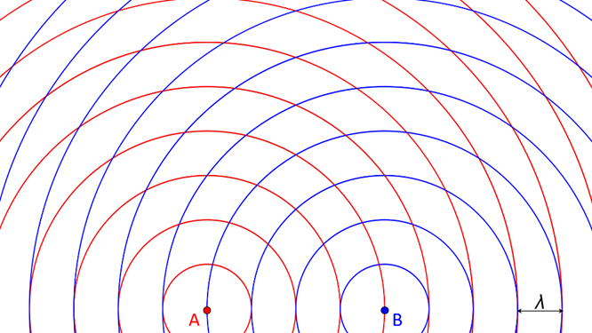
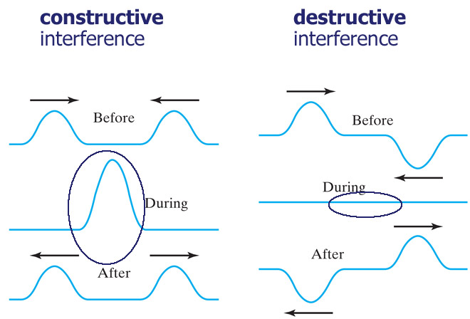

# Problem 1

### Step 1: Select a Regular Polygon

Imagine a square centered at the origin (0,0) with side length $2d$, so the vertices (our wave sources) are at:

- $S_1 = (d, d)$

- $S_2 = (d, -d)$

- $S_3 = (-d, -d)$

- $S_4 = (-d, d)$

These points are symmetrically placed, which should lead to some neat symmetry in the patterns.

### Step 2: Position the Sources

The sources are at the four corners of the square, as listed above. Each emits a circular wave that spreads outward, and we’ll assume they’re all in sync—same amplitude $A$, wavelength $\lambda$, frequency $f$, and initial phase $\phi = 0$ for simplicity (coherent sources).

### Step 3: Wave Equations

The wave from a single source at $(x_i, y_i)$ is given by:
$$
\eta_i(x, y, t) = \frac{A}{\sqrt{r_i}} \cos(kr_i - \omega t + \phi)
$$

where:

- $r_i = \sqrt{(x - x_i)^2 + (y - y_i)^2}$ is the distance from source $i$ to point $(x, y)$,

- $k = \frac{2\pi}{\lambda}$ (wave number),

- $\omega = 2\pi f$ (angular frequency),

- $\phi = 0$ (since sources are coherent with no phase offset),

- The $\frac{1}{\sqrt{r_i}}$ term accounts for amplitude decreasing with distance due to energy spreading in 2D.

For our four sources:

1. $S_1 = (d, d)$: 

   $$
   r_1 = \sqrt{(x - d)^2 + (y - d)^2}, \quad \eta_1 = \frac{A}{\sqrt{r_1}} \cos(kr_1 - \omega t)
   $$

2. $S_2 = (d, -d)$: 

   $$
   r_2 = \sqrt{(x - d)^2 + (y + d)^2}, \quad \eta_2 = \frac{A}{\sqrt{r_2}} \cos(kr_2 - \omega t)
   $$

3. $S_3 = (-d, -d)$: 

   $$
   r_3 = \sqrt{(x + d)^2 + (y + d)^2}, \quad \eta_3 = \frac{A}{\sqrt{r_3}} \cos(kr_3 - \omega t)
   $$

4. $S_4 = (-d, d)$: 

   $$
   r_4 = \sqrt{(x + d)^2 + (y - d)^2}, \quad \eta_4 = \frac{A}{\sqrt{r_4}} \cos(kr_4 - \omega t)
   $$

### Step 4: Superposition of Waves

The total displacement at any point $(x, y)$ and time $t$ is the sum of contributions from all four sources:

$$
\eta_{\text{sum}}(x, y, t) = \eta_1 + \eta_2 + \eta_3 + \eta_4
$$

$$
\eta_{\text{sum}}(x, y, t) = \sum_{i=1}^4 \frac{A}{\sqrt{r_i}} \cos(kr_i - \omega t)
$$

Since $\omega t$ is the same for all terms (coherent sources), this oscillates in time, but the spatial pattern depends on the $r_i$’s, which vary with position.

### Step 5: Analyze Interference Patterns

To understand the patterns, let’s consider the spatial part at a fixed time, say $t = 0$:

$$
\eta_{\text{sum}}(x, y, 0) = A \sum_{i=1}^4 \frac{1}{\sqrt{r_i}} \cos(kr_i)
$$

- **Constructive Interference**: Occurs when the $\cos(kr_i)$ terms are in phase (i.e., $kr_i$ values differ by multiples of $2\pi$), and the amplitudes add up. This happens when the distances $r_i$ from multiple sources to a point are such that $k(r_i - r_j) = 2\pi m$ (where $m$ is an integer).

- **Destructive Interference**: Occurs when phases cancel, e.g., $k(r_i - r_j) = (2m + 1)\pi$, making $\cos(kr_i)$ terms oppose each other.

**Symmetry Insight**: Due to the square’s symmetry:

- At the center $(0, 0)$, $r_1 = r_2 = r_3 = r_4 = \sqrt{2}d$. So:

  $$
  \eta_{\text{sum}}(0, 0, 0) = 4 \cdot \frac{A}{\sqrt{\sqrt{2}d}} \cos(k\sqrt{2}d)
  $$

  This is maximized when $k\sqrt{2}d = 2\pi m$, showing strong constructive interference if the wavelength fits the geometry.

- Along the x-axis ($y = 0$), distances vary: $r_1 = r_2 = \sqrt{(x - d)^2 + d^2}$, $r_3 = r_4 = \sqrt{(x + d)^2 + d^2}$. The pattern oscillates as $x$ changes.

The interference creates a grid-like pattern with peaks and troughs, more complex than the two-source case (which gives straight fringes).

### Step 6: Visualization

[Wave Interference Simulation](wave.html)

