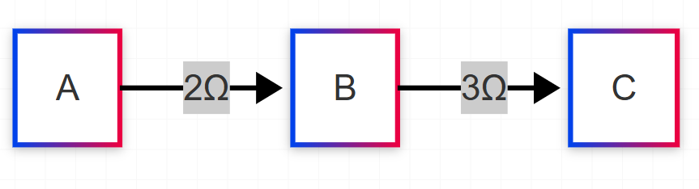
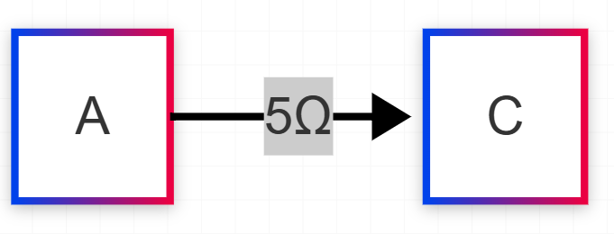
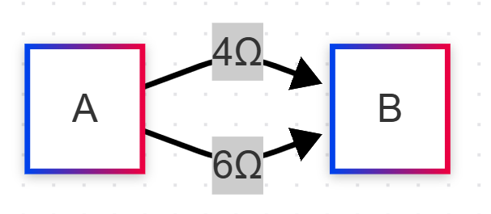
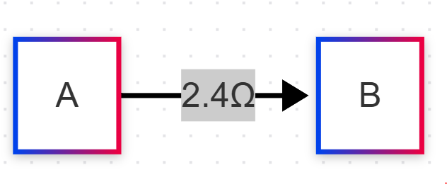
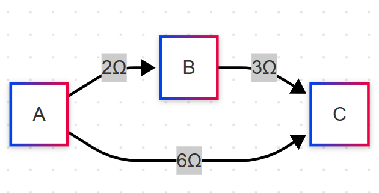
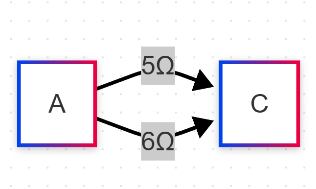
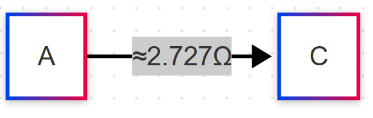

# Problem 1


# Equivalent Resistance Using Graph Theory

Calculating the equivalent resistance of a circuit is a core problem in electrical engineering. Traditional methods like series-parallel reduction can become tedious for complex networks. Graph theory provides a systematic approach by modeling circuits as graphs—nodes represent junctions, and edges represent resistors with weights as resistance values. This document presents a Python implementation to compute equivalent resistance iteratively, leveraging graph simplification techniques.

---

### Algorithm Description: Calculating Equivalent Resistance Using Graph Theory

The goal is to calculate the equivalent resistance of a circuit by modeling it as an undirected weighted graph. In this graph:

- **Nodes** represent junctions or connection points in the circuit.

- **Edges** represent resistors, with weights equal to their resistance values (in ohms).

- The equivalent resistance is computed between two specified nodes (e.g., the input and output terminals).

The algorithm iteratively simplifies the graph by identifying and reducing **series** and **parallel** resistor configurations until only two nodes remain, connected by a single edge representing the equivalent resistance. Here’s how it works:

#### Key Steps:

1. **Model the Circuit as a Graph**:

- Input: A graph with nodes (junctions) and weighted edges (resistors), plus two terminal nodes (start and end).

- Example: A series circuit with two resistors (R1 = 2Ω, R2 = 3Ω) becomes a graph with three nodes (A → B → C) and edges A-B (2Ω) and B-C (3Ω).

2. **Identify Series Connections**:

- A node with exactly two neighbors (degree 2) indicates a series connection.

- Replace the two edges (e.g., A-B with R1, B-C with R2) with a single edge (A-C) whose weight is R1 + R2.

- Remove the intermediate node (B).

3. **Identify Parallel Connections**:

- Two nodes connected by multiple edges (or a cycle of length 2) indicate parallel resistors.

- Replace parallel edges (e.g., R1 and R2 between A and B) with a single edge whose weight is given by the parallel resistance formula: $R_{eq} = \frac{R1 \cdot R2}{R1 + R2}$ (or equivalently, $\frac{1}{R_{eq}} = \frac{1}{R1} + \frac{1}{R2}$).

4. **Iterate Until Simplified**:

- Repeatedly apply series and parallel reductions until the graph has only two nodes (the terminals) and one edge.

- The weight of this final edge is the equivalent resistance.

5. **Handle Nested Configurations**:

- For complex graphs (e.g., nested series-parallel or cycles), use traversal techniques (like DFS) to detect reducible substructures.

- Prioritize series reductions when possible, then check for parallel edges.

#### Pseudocode:

```plaintext
Function CalculateEquivalentResistance(Graph G, Node start, Node end):
    Input: Graph G (nodes, edges with weights), start node, end node
    Output: Equivalent resistance between start and end

    While G has more than 2 nodes OR more than 1 edge between start and end:
        // Step 1: Check for series reductions
        For each node N in G:
            If degree(N) == 2 AND N is not start or end:
                Let neighbors of N be A and B
                Let R1 = weight(A, N), R2 = weight(N, B)
                Remove node N and edges A-N, N-B
                Add edge A-B with weight = R1 + R2

        // Step 2: Check for parallel reductions
        For each pair of nodes (A, B) in G:
            If multiple edges exist between A and B:
                Let R_values = list of weights of edges between A and B
                R_eq = 1 / (sum(1/R for R in R_values))  // Parallel formula
                Remove all edges between A and B
                Add single edge A-B with weight = R_eq

    // Final check
    If G has exactly 2 nodes (start, end) and 1 edge:
        Return weight of edge between start and end
    Else:
        Error "Graph could not be fully reduced"

End Function
```

#### Explanation of Handling Nested Combinations:

- **Series Detection**: Nodes with degree 2 are straightforward to spot and reduce. This works even in nested structures because the algorithm processes one reduction at a time.

- **Parallel Detection**: Checking for multiple edges between nodes captures parallel resistors, even if they appear after a series reduction simplifies part of the graph.

- **Nested Cases**: The iterative nature ensures that as outer layers of the circuit are simplified, inner nested structures become reducible.

---

### Example Applications

#### Example 1: Simple Series Combination

**Circuit**: Two resistors in series, 2Ω and 3Ω, between nodes A and C via B.

**Graph**: A → B (2Ω), B → C (3Ω).




**Reduction**:

  1. Node B has degree 2. Replace A-B (2Ω) and B-C (3Ω) with A-C (2 + 3 = 5Ω).

  2. Graph becomes A → C (5Ω).

  


**Result**: Equivalent resistance = 5Ω.

#### Example 2: Simple Parallel Combination

**Circuit**: Two resistors in parallel, 4Ω and 6Ω, between nodes A and B.

**Graph**: A → B (4Ω), A → B (6Ω) (two edges).




**Reduction**:

  1. Parallel edges detected. Compute $R_{eq} = \frac{4 \cdot 6}{4 + 6} = \frac{24}{10} = 2.4Ω$.

  2. Replace both edges with A-B (2.4Ω).

  

**Result**: Equivalent resistance = 2.4Ω.

#### Example 3: Nested Configuration

**Circuit**: Two resistors in series (2Ω, 3Ω), with a parallel resistor (6Ω) across the pair.

**Graph**: 

  - A → B (2Ω), B → C (3Ω) [series part].

  - A → C (6Ω) [parallel across A-C].

  

**Reduction**:

  1. Reduce series A-B (2Ω) and B-C (3Ω): Remove B, add A-C (2 + 3 = 5Ω).



  2. Graph now has A → C (5Ω) and A → C (6Ω) [two edges in parallel].

  

  3. Compute parallel: $R_{eq} = \frac{5 \cdot 6}{5 + 6} = \frac{30}{11} \approx 2.727Ω$.

- **Result**: Equivalent resistance ≈ 2.727Ω.


