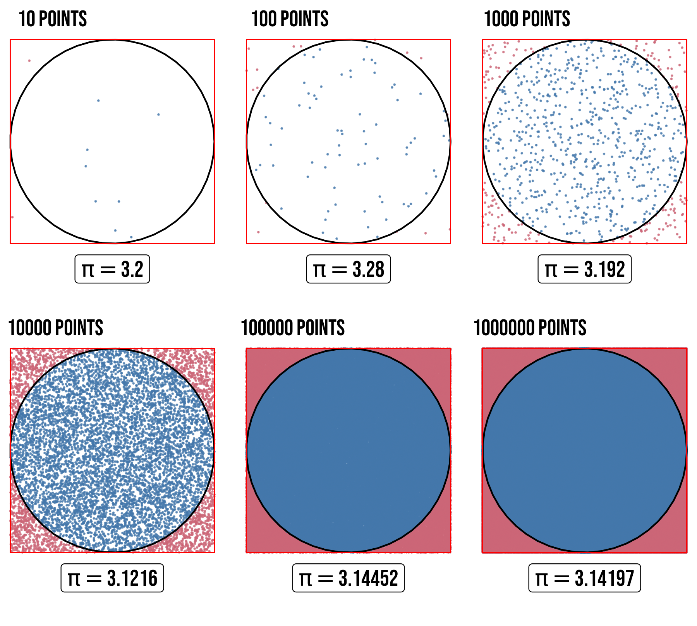

# Problem 2

# **Estimating π using Monte Carlo Methods**

## **Motivation**

Monte Carlo methods are computational algorithms that rely on random sampling to estimate numerical results. One of the most intuitive applications is estimating the value of π using geometric probability. This approach demonstrates how randomness can be harnessed to solve deterministic problems, providing insights into probability, geometry, and numerical convergence.

Two classic Monte Carlo methods for estimating π are:

1. **Circle-based method**: Dropping random points inside a square and counting those that fall within an inscribed circle.

2. **Buffon’s Needle method**: Randomly dropping needles on a lined surface and using the probability of crossings to estimate π.

These methods not only offer a visual and interactive way to approximate π but also serve as an introduction to stochastic simulations in computational mathematics.

---

## **Part 1: Estimating π Using a Circle**

### **1. Theoretical Foundation**

Consider a unit circle (radius = 1) inscribed inside a square with side length 2.  

- **Area of the circle** = $πr² = π(1)² = π$  
- **Area of the square** = $side² = 2² = 4$  

If we randomly scatter points inside the square, the probability that a point lands inside the circle is: 

$$ P(\text{inside circle}) = \frac{\text{Area of circle}}{\text{Area of square}} = \frac{\pi}{4} $$ 

Rearranging, we get:  

$$ \pi \approx 4 \times \frac{\text{Number of points inside circle}}{\text{Total number of points}} $$ 

### **2. Simulation**
1. Generate random $(x, y)$ points in the range $[-1, 1] × [-1, 1]$.  

2. Check if each point satisfies $x^2 + y^2 \leq 1$ (inside the circle).  

3. Estimate π using the ratio of points inside the circle to the total points.  

[xx](d.html)

### **3. Visualization**

### **4. Analysis**
- **Convergence**: The estimate improves with more points, but the error decreases slowly (~1/√N).
- **Computational Considerations**: Large N improves accuracy but increases runtime.

---

## **Part 2: Estimating π Using Buffon’s Needle**

### **1. Theoretical Foundation**
Buffon’s Needle involves dropping a needle of length \( L \) on a plane with parallel lines spaced distance \( D \) apart.  
- If \( L \leq D \), the probability \( P \) of the needle crossing a line is:  
\[ P = \frac{2L}{\pi D} \]  
- Solving for π:  
\[ \pi \approx \frac{2L \times \text{Total throws}}{D \times \text{Number of crossings}} \]  

### **2. Simulation**
1. Simulate random needle drops with random position and angle.  
2. Check if the needle crosses any of the parallel lines.  
3. Estimate π using the derived formula.  

### **3. Visualization**
A plot can show:
- The parallel lines.
- Needles colored differently based on whether they cross a line.

### **4. Analysis**
- **Convergence**: Slower than the circle method (~1/N).
- **Comparison**: The circle method is more efficient for the same number of iterations.

---

## **Deliverables**
1. **Markdown Report** (this document).  
2. **Python Implementation** (Jupyter Notebook or script) with:  
   - Circle-based π estimation.  
   - Buffon’s Needle simulation.  
3. **Graphical Outputs**  
   - Scatter plots for the circle method.  
   - Needle-drop visualizations for Buffon’s method.  
4. **Analysis**  
   - Convergence plots (π estimate vs. number of iterations).  
   - Comparison of computational efficiency.  

---

## **Conclusion**
Monte Carlo methods provide an engaging way to estimate π using randomness. While the circle method converges faster, Buffon’s Needle offers historical and geometric insights. Both methods illustrate the power of probabilistic simulations in numerical computation.  

**Further Exploration**:  
- Variance reduction techniques (e.g., importance sampling).  
- Higher-dimensional generalizations (e.g., sphere in a cube).  
- Parallel computing for faster convergence.  

---

### **References & Resources**
- *Numerical Recipes* by Press et al.  
- *Introduction to Probability Models* by Sheldon Ross.  
- Python libraries: `numpy`, `matplotlib`, `random`.  

---

Would you like the accompanying Python code for these simulations?